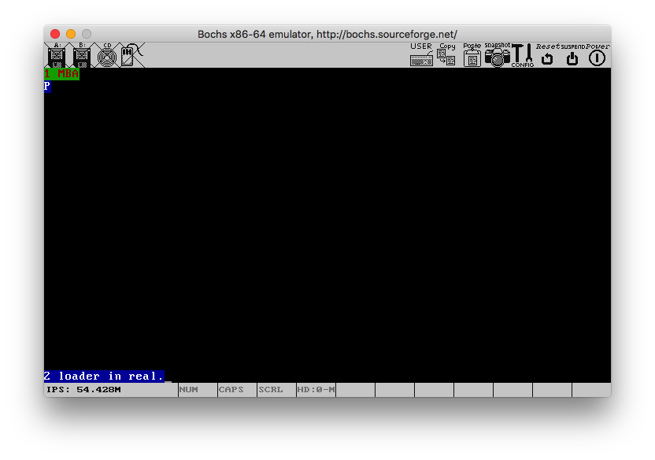
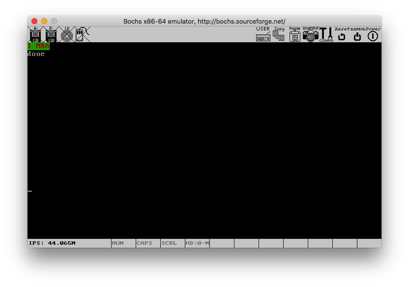
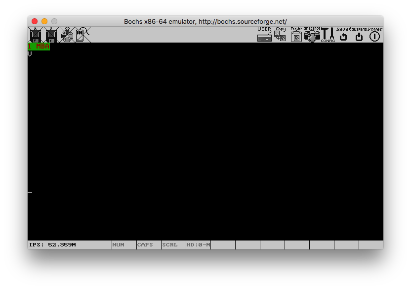
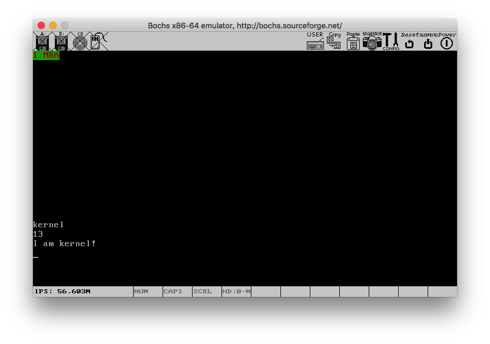

# tiny-os
## 环境准备

### Bochs

在Mac上使用以下命令安装:

```shell
brew install bochs
```

### 配置

每个章节下的bios配置部分应视bochs的具体版本而定，可自行修改：

```html
# 对应真实机器的bios
romimage: file=/usr/local/Cellar/bochs/2.6.9_2/share/bochs/BIOS-bochs-latest
# 对应真实机器的VGA bios
vgaromimage: file=/usr/local/Cellar/bochs/2.6.9_2/share/bochs/VGABIOS-lgpl-latest
```

## 说明

每个章节下的代码均可以独立运行，在对应的目录下执行以下命令即可启动：

```shell
./build.sh
```

即可启动执行。完毕之后可执行以下命令清理环境：

```shell
./clean.sh
```

## 运行

### 第三章


### 第四章



有以下几点需要注意:

1. 书中的源码boot.inc的DESC_LIMIT_VIDEO2定义可能有误，应修改为:

   ```assembly
   DESC_LIMIT_VIDEO2 equ 00000000000000000000000000001011b
   ```

   原因是保护模式的基地址是0xb8000，所以最后8位应该是b，而不是0，这样才能正确显示字母'P'。

   第164页的图4-11同样有问题，第4个GDT表项(显存)的base应该等于0xb8000，因为如果是图中的0xc00b8000，那么对应的物理内存地址是3072MB处，明显不合理。

2. Mac上的nasm并不支持数字中间以下划线分割的写法，会出现编译错误。

3. 第161页代码4-3的21行为:

   ```assembly
   times 60 dq 0
   ```

   Apple版本的nasm这样写会报错，原因是不能把int型的0赋给dq。稍加变通即可:

   ```assembly
   times 120 dd 0
   ```

### 第五章

#### 内存检测

这里对书中源码进行了改造，只使用e820一种方式，检测失败时会在第一行显示字符串: 'failed'，成功将在第二行显示: 'done'，如下图:



内存检测的结果通过命令: `x /4wx 0xb00`查看，如下图:


结果正是我们设置的内存大小: 32MB，无误。

#### 内存分页



这一节注意要和前面的保护模式、内存检测部分结合起来。

#### 加载内核

由于此时没有可以用于打印的手段，所以正确性需要到下一章节验证。此部分需要使用Linux交叉编译器中的ld命令才可以正常链接，Mac自带的无法使用，Mac上的安装参考:

[11-kernel-crosscompiler](https://github.com/cfenollosa/os-tutorial/tree/master/11-kernel-crosscompiler)

### 第六章

#### 打印字符串



这里是打印字符和打印字符串两者结合的效果，这里遇到了一个奇怪的问题，如果在main.c中存在除main之外的其它函数，那么实验结果将不正确，原因未知。

#### 打印数字

